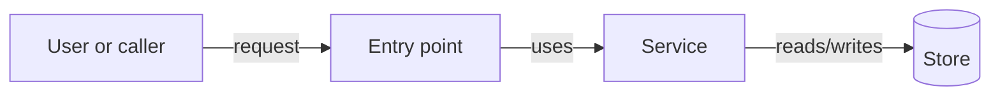

# Architecture

## Context

Describe the internal shape of the future delivery slice and the existing
boundaries it must respect.

## Components

| Component | Responsibility |
| --- | --- |
| TBD | TBD |

## Flow

Use Mermaid when the relationship between moving parts is easier to show than
explain. Mermaid is valuable here because it stays readable as Markdown for
agents while rendering as a visible diagram for humans.

## Data And Contracts

Describe entities, DTOs, events, messages, config, migrations, or external
contracts expected to be affected.

## Boundaries

Describe ownership boundaries, shared layers, external dependencies, and
what this planned initiative must not take over.

## Security And Compliance

Capture authentication, authorization, data residency, audit, privacy,
secret handling, and abuse cases.

## Test Strategy

List the tests or verification paths expected to provide confidence.
