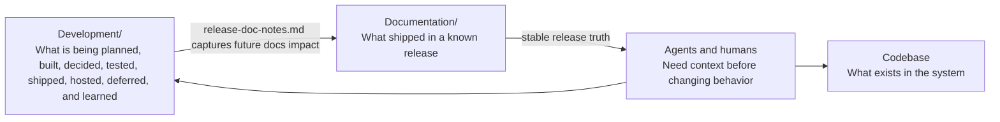
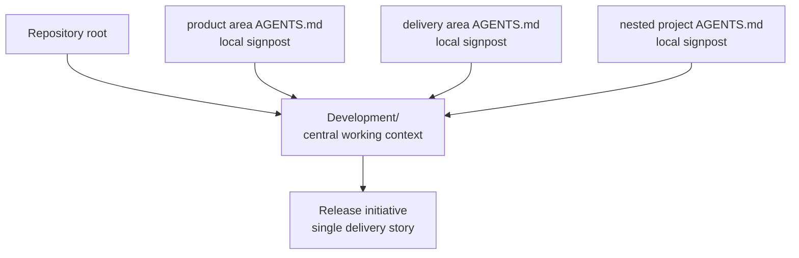
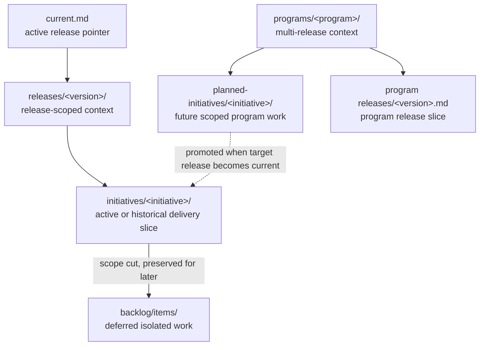
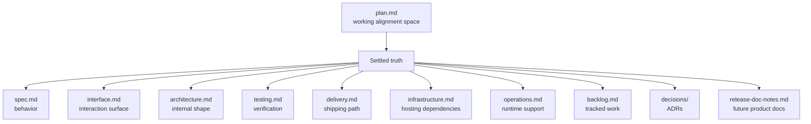
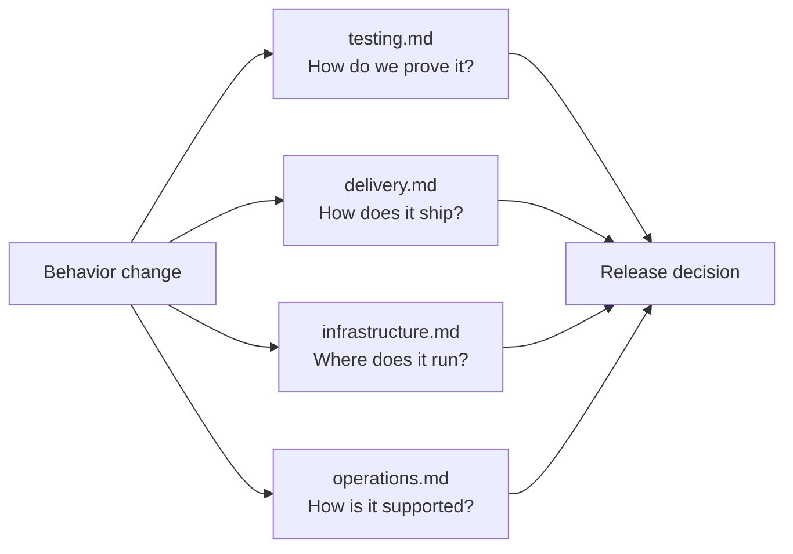
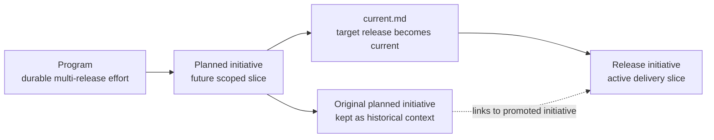
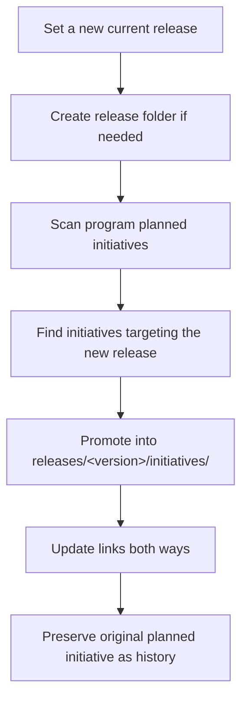

# Giving AI Agents The Context Around The Code

AI agents are becoming more capable at reading repositories, editing files,
and following instructions. But in large enterprise codebases, code is not the
whole story.

The hard part is not whether an agent can change a file. The hard part is
whether it understands the intent behind the change, the current release scope,
the decisions already made, the work deliberately deferred, how the change
should be verified, how it will ship, and what infrastructure or operational
risks surround it.

That context usually exists somewhere: chats, tickets, pull request comments,
planning notes, architecture discussions, test plans, deployment notes,
infrastructure conversations, and people's heads. The problem is that agents
need this context in a structured, discoverable form.

This is why I started separating **released product documentation** from
**development context**.

```text
Documentation/
  What shipped.

Development/
  What we are planning, building, deciding, testing, shipping, hosting,
  deferring, and learning.
```

Product documentation should stay stable and release-accurate. It should
describe the behavior of a known release, not the current shape of an unfinished
branch.

Development context is different. It is allowed to evolve. It is where humans
and agents work through ambiguity.

Over time, I have started thinking about this as **Code-Anchored Context**.

Not a new methodology. More a rule of thumb.

Keep truth as close to code as possible, and keep the surrounding context
structured enough that both humans and agents can find it.

It is opinionated on purpose: prefer repository-local context, explicit
lifetimes, and navigable structure over scattered notes that only make sense to
the people who were in the room. Repository-local context beats private notes
because it scales beyond one person. Shared `.mcp` registrations, machine-independent
continuity, and persisted context snapshots carry decisions forward without
re-compressing them every session, cutting noise while preserving intent.

One practical benefit is that the reasoning travels with the work.

When context is materialized in the repository, it stops being tied to one
chat transcript, IDE, agent, or session. A team can switch tools without
losing the trail of why the system is shaped the way it is. The next human or
agent can open the repo, read the development context, and continue from the
same accumulated understanding instead of reconstructing it from memory. That
continuity keeps hours of planning from being lost and makes handoffs between
models and team members materially better.



## The Navigation Problem

In large repositories, agents and IDEs do not always open the workspace from
the root. They may start in product code, CI/CD config, infrastructure code,
generated artifacts, a specific application, or a nested project folder.

If all guidance lives at the top, it may be missed. But if each area keeps its
own plans, cross-project work becomes fragmented.

So the rule became:

> Denormalize navigation, not knowledge.

Local `AGENTS.md` files can point agents toward the right place. But plans,
specs, ADRs, release context, testing strategy, delivery notes, and
infrastructure context should live centrally under `Development/`.



## The Core Model

Code-Anchored Context uses explicit terminology, captured in
`Development/terminology.md`. That matters because agents need stable
vocabulary as much as humans do.

The main containers are:

```text
Program
  Long-lived multi-release effort.

Planned initiative
  A scoped future delivery slice inside a program.

Release initiative
  Active or historical delivery work for a specific release.

Development backlog item
  Isolated work cut from scope but worth preserving.

Program release slice
  A summary of what a release contributes to a program.
```

This gives each kind of context a natural home.

```text
Development/
  terminology.md
  current.md
  programs/
  backlog/
  releases/
  _templates/
```

The structure follows delivery concerns, not technologies. A file should be
named for the kind of knowledge it preserves, not for the tool that produced
it.



## Release Initiatives

Release initiatives are the main unit of active delivery.

```text
Development/releases/v0_1_0/initiatives/<initiative>/
  README.md
  plan.md
  spec.md
  interface.md
  architecture.md
  testing.md
  delivery.md
  infrastructure.md
  operations.md
  backlog.md
  decisions/
  release-doc-notes.md
```

Even if a change only affects one application, the initiative still lives
centrally. Many meaningful changes eventually touch UI, API, data, tests,
pipelines, deployment, infrastructure, support processes, or release
documentation. Keeping the story together prevents each folder from telling
only part of the truth.

The most important file is `plan.md`.

`plan.md` is the working alignment space for humans and agents. It can contain
rough notes, options, questions, tradeoffs, and discussion residue.

But with one rule:

> `plan.md` is allowed to be messy, but it must not become the only place where
> settled truth lives.

Once something stabilizes, it moves into the right durable file:

```text
spec.md
  What the system should do.

interface.md
  How humans, clients, APIs, config, reports, or tools interact with it.

architecture.md
  Internal shape, boundaries, data flow, contracts, and tradeoffs.

testing.md
  Verification strategy, automated and manual coverage, test data,
  release gates, and known gaps.

delivery.md
  CI/CD, build behavior, deployment flow, environment promotion,
  release toggles, and delivery automation.

infrastructure.md
  Environment shape, IaC, resources, networking, identity, storage,
  secrets, and environment dependencies.

operations.md
  Actionable runtime and support context: observability, failure modes,
  rollback, repair, support procedures, and tooling.

backlog.md
  Trackable work items and implementation progress.

decisions/
  Durable decisions and consequences.

release-doc-notes.md
  What should become product documentation later.
```



Not every initiative needs every file. A small UI-only change may not need
infrastructure notes. A backend migration may need detailed testing and
rollback notes. A hosting change may need infrastructure and delivery context
more than interface context.

The point is not to fill templates for their own sake. The point is to give
stable knowledge a place to land.

## Testing, Delivery, And Infrastructure

The model treats verification, delivery, and infrastructure as first-class
development context.

That matters because agents often need to answer questions beyond "what code
should change?"

They also need to know:

- What proves this is safe to ship?
- Which automated, manual, regression, smoke, contract, or performance tests
  matter?
- What test data or environments are required?
- Which gates must pass before merge, deployment, promotion, or release?
- Does the pipeline, build, artifact, deployment order, or environment
  promotion flow change?
- Are there feature flags, kill switches, staged rollout controls, or delivery
  scripts?
- Does the work require new infrastructure, secrets, identity boundaries,
  storage, networking, runtime hosts, or IaC changes?
- Are there provisioning, migration, compatibility, or cleanup constraints?

Those answers do not belong only in scattered pipeline files, pull requests, or
private memory. They belong near the initiative, where future humans and agents
can find them.

This also keeps `operations.md` focused. Operations is for actionable runtime
and support context: observability, failure modes, rollback, repair, and
support tooling. Testing, delivery, and infrastructure each have their own home
when those concerns affect how the work is verified, shipped, deployed, or
hosted.



## Programs And Planned Initiatives

Some work is bigger than one release.

A program holds durable context for multi-release work:

```text
Development/programs/<program>/
  README.md
  context.md
  roadmap.md
  backlog.md
  decisions/
  planned-initiatives/
  releases/
```

A program is where the long arc lives: the roadmap, phase history, durable
decisions, and release-by-release summaries.

But not all future work should become a release initiative immediately. If a
future phase is clear enough to plan, but the target release is not current
yet, it becomes a planned initiative:

```text
Development/programs/<program>/planned-initiatives/<initiative>/
```

A planned initiative can also preserve future testing, delivery, or
infrastructure intent before the work becomes active. That is useful when the
future phase depends on a migration path, environment readiness, release gates,
or rollout sequencing.

This solves an important problem. Future work can be preserved without
pretending it is active in the current release.

When the target release becomes current, the planned initiative is promoted
into:

```text
Development/releases/<version>/initiatives/<initiative>/
```

Promotion is explicit and traceable. The original planned initiative remains
as historical planning context.



## Development Backlog

Not every deferred item deserves a program or planned initiative.

Sometimes work is cut from scope because of risk, timing, or focus, but it is
still worth preserving. That belongs in:

```text
Development/backlog/items/
  <originating-initiative>--<item>.md
```

Each item records where it came from, why it was deferred, future value, and
re-entry criteria.

If it is picked up later, it is marked as promoted and linked to the new
release initiative. It is not silently rewritten.

## Release Transitions

Changing the current release is not just editing a pointer.

`Development/current.md` identifies the active release, but moving from one
release to another is a release transition. During that transition, agents
should scan program planned initiatives, find items targeting the new release,
promote them into the release folder, and update links both ways.

That makes future planning usable instead of forgotten.

It also matters for delivery concerns. Planned testing strategy, rollout
constraints, infrastructure prerequisites, and release gates should move into
the active release context when the initiative becomes real delivery work.



## Why This Matters

Code-Anchored Context is not documentation for documentation's sake. It is
context continuity.

It helps agents and humans answer:

- What is active now?
- What belongs to a future phase?
- What was cut from scope?
- Why was this decision made?
- Which release owns this work?
- How should this be tested?
- What gates must pass before release?
- How will this be built, deployed, promoted, or rolled out?
- What infrastructure does this depend on?
- What operational risks need support or rollback context?
- What should become product documentation later?
- What should not be changed by accident?
- What reasoning needs to survive a change of IDE, agent, or session?
- What context should travel with the repository instead of a private chat?

The mental model is simple:

```text
Documentation/
  Released truth.

Development/releases/
  Release-scoped delivery truth.

Development/programs/
  Multi-release truth.

Development/programs/*/planned-initiatives/
  Future scoped program work.

Development/backlog/
  Deferred isolated work.

Development/terminology.md
  Shared vocabulary.

AGENTS.md
  Local signposts for agents.
```

Code tells an agent what exists.

Development context tells it why it exists, where it is going, what has
already been decided, how it should be verified, how it should ship, what
infrastructure it relies on, and what has intentionally been left for later.

As AI agents become part of normal software delivery, repositories need to
become easier to navigate not only for humans, but for human-agent
collaboration. Code-Anchored Context is one opinionated way to make that
collaboration explicit, durable, and safer.
