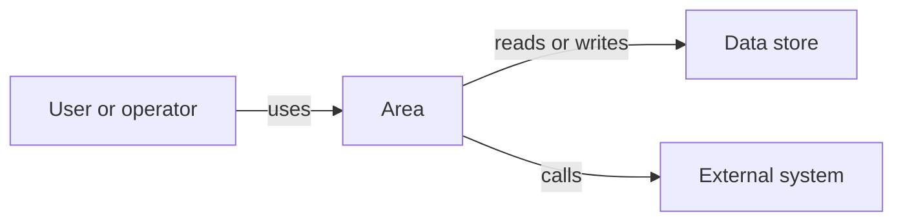

# Area Name

Briefly describe what this area does, who uses it, and why it exists.

## Reader Summary

Explain the area in product or domain language. A Product Owner should be able
to understand the purpose, scope, and user or business value from this section.

## Primary Workflows

- TBD

## Architecture At A Glance

## Responsibilities

- TBD

## Data And State

Describe the important records, files, queues, external state, or generated
artifacts this area creates, reads, or changes.

- TBD

## Configuration And Dependencies

List configuration, environment assumptions, external systems, scheduled jobs,
or infrastructure this area depends on.

- TBD

## Operational Expectations

Describe support, observability, recovery, audit, or routine operational
expectations that matter to readers.

- TBD

## Source References

Optional links to source files, generated references, dashboards, runbooks, or
release context that help technical readers verify behavior. Keep explanation
in this page instead of replacing it with links.

- TBD

## Feature Pages

- [Feature Name](features/feature-template.md)
