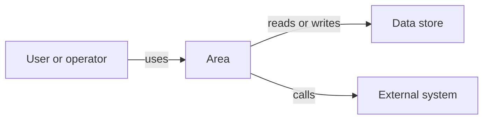

# Area Name

Briefly describe what this area does, who uses it, and why it exists.

## Architecture At A Glance

## Responsibilities

- TBD

## Feature Pages

- [Feature Name](features/feature-template.md)
