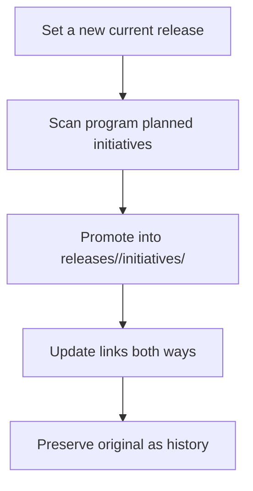

# Code-Anchored Context: The Structure

This is the companion to the
[reasoning article](code-anchored-context-why.md). It covers how working
context is laid out so both humans and agents can navigate it.

## Denormalize Navigation, Not Knowledge

Agents and IDEs do not always open from the repo root. They may start in
product code, CI/CD config, infrastructure code, generated artifacts, or a
nested app. If all guidance lives at the top, it gets missed. If each area
keeps its own plans, cross-project work fragments.

> Denormalize navigation, not knowledge.

Local `AGENTS.md` files point agents toward the right place. But plans, specs,
ADRs, release context, testing strategy, delivery notes, and infrastructure
context live centrally under `context/`.

## The Core Model

Vocabulary is captured in `context/terminology.md`. The main containers:

```text
Program                  Long-lived multi-release effort.
Planned initiative       A scoped future slice inside a program.
Release initiative       Active or historical work for a specific release.
Context backlog item     Isolated work cut from scope but worth preserving.
Program release slice    What a release contributes to a program.
```

Each kind of context gets a home:

```text
context/
  terminology.md
  current.md
  programs/
  backlog/
  releases/
  _templates/
```

Structure follows delivery concerns, not technologies. Name a file for the
knowledge it preserves, not the tool that produced it.

## Release Initiatives

The main unit of active delivery:

```text
context/releases/<version>/initiatives/<initiative>/
  README.md   plan.md   spec.md   interface.md   architecture.md
  testing.md  delivery.md  infrastructure.md  operations.md
  backlog.md  decisions/  release-doc-notes.md
```

The most important file is `plan.md` — the working alignment space. It can be
messy with notes, options, and tradeoffs, with one rule:

> `plan.md` may be messy, but it must not be the only place settled truth lives.

Once something stabilizes, it moves to a durable file:

```text
spec.md              What the system should do.
interface.md         How clients, APIs, config, or tools interact with it.
architecture.md      Internal shape, boundaries, data flow, tradeoffs.
testing.md           Verification strategy, coverage, gates, known gaps.
delivery.md          CI/CD, build, deployment, promotion, release toggles.
infrastructure.md    Environments, IaC, networking, identity, storage, secrets.
operations.md        Runtime/support: observability, failure modes, rollback.
backlog.md           Trackable work items and progress.
decisions/           Durable decisions and consequences (ADRs).
release-doc-notes.md What should become product documentation later.
```

Not every initiative needs every file. The point is to give stable knowledge a
place to land — testing, delivery, and infrastructure are first-class context,
not afterthoughts buried in pipeline files or PRs.

## Programs And Planned Initiatives

Some work is bigger than one release. A program holds durable multi-release
context:

```text
context/programs/<program>/
  README.md  context.md  roadmap.md  backlog.md
  decisions/  planned-initiatives/  releases/
```

Future work that is clear enough to plan — but whose target release is not
current yet — becomes a planned initiative:

```text
context/programs/<program>/planned-initiatives/<initiative>/
```

When the target release becomes current, it is promoted into
`context/releases/<version>/initiatives/<initiative>/`. Promotion is
explicit; the original planned initiative stays as historical context.

## Context Backlog

Work cut from scope but worth preserving — when it doesn't justify a program or
planned initiative — lives in:

```text
context/backlog/items/<originating-initiative>--<item>.md
```

Each item records where it came from, why it was deferred, future value, and
re-entry criteria. If picked up later, it is marked promoted and linked — never
silently rewritten.

## Release Transitions

Changing the current release is more than editing a pointer. When
`context/current.md` moves to a new release, agents should scan program
planned initiatives, promote items targeting the new release into the release
folder, update links both ways, and preserve the originals as history.


