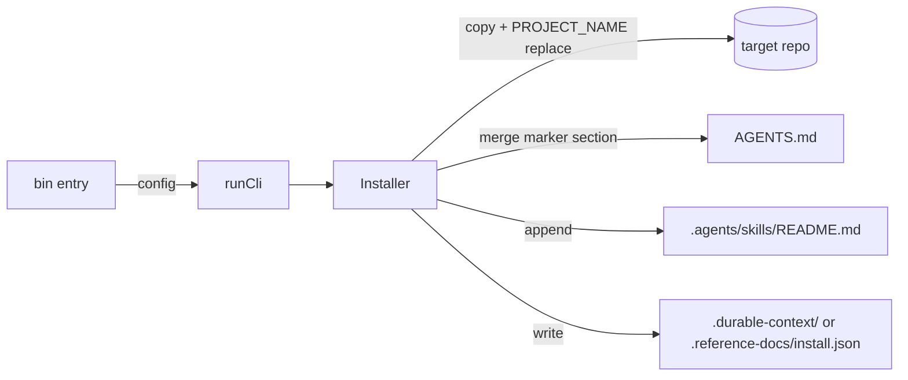

# Architecture

## Context

npm workspaces monorepo. Root is private. Each package under `packages/` publishes
independently with its own installer, template payload, and smoke tests.

This initiative renames packages and retires umbrella branding; the two-package
split from decision 0001 remains in force.

## Layout (target)

```text
/ (private root: durable-context-monorepo)
  README.md                 repo entry; links to writing/ for maintainers
  writing/                  maintainer narrative only — NOT installed, NOT product
  context/                  dogfood working bench (installed scaffold shape)
  decisions/                dogfood decision log
  packages/
    durable-context/        published npm package
    reference-docs/         published npm package
```

## Product boundary

What adopters get from `npx durable-context init` / `npx reference-docs init`:

- Scaffold trees (`context/`, `decisions/`, `reference/`)
- `.agents/skills/*`
- `AGENTS.md` marker section

What adopters do **not** get:

- `writing/` (this monorepo only)
- Root monorepo `README.md`, `context/initiatives/`, or initiative planning artifacts

Package `README.md` is on npm for install instructions but is not copied into
the target repo by `init`.

## Installer

Same generic `lib/installer.js` per package, driven by `config` from each
`bin/` entry.



## Coexistence in one adopter repo

- Distinct AGENTS.md marker pairs: `durable-context:*`, `reference-docs:*`.
- Distinct metadata dotdirs and `install.json` files.
- Skills copied per-name into `.agents/skills/<name>/`.

## Context-window footprint

No line-count targets. Skills state what to do precisely; templates hold file
structure so skills do not repeat it.

| Layer | In adopter repo? | Role |
| --- | --- | --- |
| Skills | Yes | Invoked workflow steps and boundaries |
| Templates | Yes | Section stubs and one-line intent per concern doc |
| Package README | No (npm only) | Install summary; not copied by `init` |
| `writing/` | **No** | Monorepo maintainer narrative; never installed |

| Asset | Load pattern | Design rule |
| --- | --- | --- |
| `SKILL.md` | On explicit invocation | Precise numbered workflow; link to templates for doc shapes |
| `AGENTS.md` section | Frequent | Short pointers to skills |
| Initiative templates | On initiative work | Structure only; checklist in `plan-with-context` |
| `reference/_authoring/workflow.md` | During reference skills | Procedural; deduped vs skills |

Optional later: `disable-model-invocation: true` in skill frontmatter so skills
never auto-load from routing metadata (deferred; not required for 1.0.0).

## Dogfood sync

Package template under `packages/durable-context/template/` is canonical for
`context/` and `decisions/` scaffold. After the template review pass, copy
into root `context/_templates/`, `context/project-profile.md`, and
`context/README.md`. Root `context/AGENTS.md` stays repo-specific (paths and
branding only).

## Boundaries

- durable-context never writes `reference/`.
- reference-docs never requires `context/`; may optionally read
  `release-doc-notes.md`.
