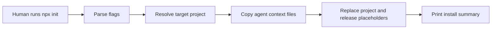

# Architecture

## Context

This repository is already the canonical template. Its root files are the
files future projects need: `AGENTS.md`, `.agents/skills/`, `context/`,
and optionally `reference/`.
Repo-wide stack and toolchain facts are represented by
`context/project-profile.md` after installation; the reusable skill stays
generic.

## Components

| Component | Responsibility |
| --- | --- |
| `package.json` | Defines package metadata, published files, and the CLI binary. |
| `bin/code-anchored-context.js` | Parses flags, copies template paths, applies placeholder replacements, and prints the install summary. |
| Template root files | Provide the actual context files copied into target repositories, including the optional project profile starter. |

## Flow

## Data And Contracts

- `PROJECT_NAME` placeholders are replaced with the selected project name.
- `v0_1_0` placeholders are replaced with the selected initial release.
- Custom release slugs are limited to path-safe characters.
- Existing generated paths are skipped unless `--force` is passed.

## Boundaries

- The CLI owns installation only.
- The target repository owns all future edits after installation.
- Existing `AGENTS.md` content is preserved; the CLI appends or refreshes only
  the bounded Code-Anchored Context section.
- The package has no runtime dependencies.

## Security And Compliance

No secrets or credentials are handled. Publishing requires normal npm account
authorization for the chosen package name or scope.

## Test Strategy

Use Node's built-in test runner for temporary-directory smoke tests. Before
publishing, run `npm pack --dry-run` to verify package contents.
