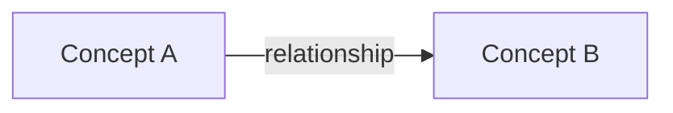

# Project Terminology

Use this file to define the domain language that documentation should use.

Docs should translate code-level names into reader-facing domain
terms when those differ. The goal is consistency for QA, product, support,
operators, and future agents.

## Core Terms

| Term | Meaning | Code-level names to translate |
| --- | --- | --- |
| TBD | TBD | TBD |

## Relationships

Use this section for named relationships between important domain concepts.

| Relationship | Between | Meaning |
| --- | --- | --- |
| TBD | TBD | TBD |

## Guardrails

Capture wording rules that prevent misleading documentation.

Examples:

- Prefer one canonical term over an overloaded code name.
- Avoid implying that a relationship is permanent when it can change.
- Call out standards-driven terms that must remain as-is.

## Diagram

Add a Mermaid diagram when relationships are easier to understand visually.

