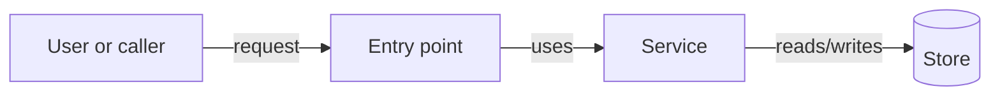

# Architecture

## Context

Describe the internal shape of the solution and the existing boundaries this
initiative must respect.

## Components

| Component | Responsibility |
| --- | --- |
| TBD | TBD |

## Flow

Use Mermaid when the relationship between moving parts is easier to show than
explain. Mermaid is valuable here because it stays readable as Markdown for
agents while rendering as a visible diagram for humans.

## Data And Contracts

Describe entities, DTOs, events, messages, config, migrations, or external
contracts affected by the initiative.

## Boundaries

Describe ownership boundaries, shared layers, external dependencies, and
what this initiative must not take over.

## Security-Relevant Boundaries

Identify trust boundaries, privileged components, identity flows, and
sensitive data paths. Keep threat analysis, control choices, residual risk,
and security verification in `security.md` when that concern is material.

## Test Strategy

List the tests or verification paths needed for confidence.
