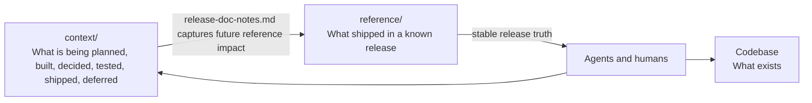

# Code-Anchored Context: Giving AI Agents The Context Around The Code

AI agents are good at reading repositories, editing files, and following
instructions. But in large codebases, code is not the whole story.

The hard part is not whether an agent can change a file. It is whether it
understands the intent behind the change, the current release scope, the
decisions already made, the work deliberately deferred, how the change should
be verified, how it ships, and what infrastructure or operational risks
surround it.

That context usually exists — in chats, tickets, pull request comments,
planning notes, and people's heads — but agents need it in a structured,
discoverable form.

## Reference vs Working Context

This is why I separate **released reference** from **working
context**:

```text
reference/   What shipped.
context/      What we are planning, building, deciding, testing,
                  shipping, hosting, deferring, and learning.
```

Reference stays stable and release-accurate: it describes a known
release, not an unfinished branch. Working context is allowed to evolve —
it is where humans and agents work through ambiguity.

## The Principle

I think of this as **Code-Anchored Context**. Not a methodology — a rule of
thumb:

> Keep truth as close to code as possible, and keep the surrounding context
> structured enough that both humans and agents can find it.

It is opinionated on purpose: prefer repository-local context, explicit
lifetimes, and navigable structure over scattered notes that only make sense
to the people who were in the room. Repository-local context scales beyond one
person.

## Why It Travels

When context is materialized in the repository, it stops being tied to one
chat transcript, IDE, agent, or session. A team can switch tools without
losing the trail of why the system is shaped the way it is. The next human or
agent opens the repo and continues from the same accumulated understanding
instead of reconstructing it from memory.



## Why It Matters

Code-Anchored Context is context continuity. It helps agents and humans answer:

- What is active now, and what belongs to a future phase?
- What was cut from scope, and why was a decision made?
- How should this be tested, and what gates must pass before release?
- How will it ship, and what infrastructure does it depend on?
- What should become reference later?
- What reasoning needs to survive a change of IDE, agent, or session?

Code tells an agent *what exists*. Working context tells it *why* it
exists, where it is going, what has been decided, and what was left for later.

For the concrete folder layout, see the companion article,
[Code-Anchored Context: The Structure](code-anchored-context-structure.md).
