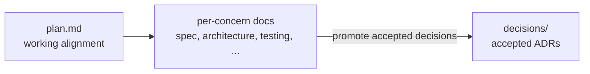

# Durable Context: The Model

The companion article,
[Durable Context: The Rationale](rationale.md), explains the painpoints:
reasoning lost to closed sessions, plans that cannot be shared, and context
that never survives a tool change. This article is the model that responds to
that problem.

Durable Context keeps planning context in the repository, structured enough
that humans and agents can find it, then distills the decisions that must
survive into an append-only decision log.

## The Two Roots

Durable Context installs two roots:

```text
context/     Disposable working bench for active planning and delivery context.
decisions/   Durable, append-only record of why the system is the way it is.
```

`context/` is allowed to drift. It is where teams work through ambiguity,
record tradeoffs, plan verification, name delivery risks, and leave notes for
future documentation. It is working-time scaffolding, not permanent history.

`decisions/` is the opposite. Accepted architectural and design decisions move
there so they remain findable after an initiative is archived.

Shipped-behavior documentation is a separate practice:
[Reference Docs](../reference-docs/model.md). Durable Context can leave
`release-doc-notes.md` for that later workflow, but it does not depend on it.

## The Working Bench

The working bench is flat:

```text
context/
  initiatives/<slug>/
  project-profile.md
  _templates/initiative/
decisions/
  0001-some-decision.md
  0002-another-decision.md
```

Structure follows delivery concerns, not technologies. Name a file for the
knowledge it preserves, not the tool that produced it.

The `_templates/` folders live beside the documents they create on purpose.
Skills use them, but they are not private skill assets. Once installed, they
become part of the repository's operating model: a team can trim, rename,
expand, or specialize them to match how that repo plans, ships, documents, and
makes decisions.

`project-profile.md` holds stable repo-wide operating facts: source roots,
commands, verification layers, delivery paths, infrastructure notes, generated
artifacts, and known unknowns. Initiatives should not rediscover those basics
every time.

## Installed Invocation Skills

The installed skills are the operational interface to this model. They are
discoverable after install, but invocation-only: humans ask for them by name
when the work calls for that step.

- `project-profile-baseline` establishes stable repo-wide operating facts in
  `context/project-profile.md`.
- `project-profile-refresh` updates those stable facts when repository behavior
  changes.
- `plan-with-context` creates or uses an initiative and drafts the durable plan
  in `plan.md`.
- `devils-advocate` challenges a draft plan before it hardens.
- `dive-into-plan` interrogates gaps, distributes settled truth, and records or
  promotes ADRs.

## Initiatives

An initiative is one folder per meaningful piece of work:

```text
context/initiatives/<slug>/
  README.md   plan.md   spec.md   interface.md   architecture.md
  testing.md  delivery.md  infrastructure.md  operations.md
  backlog.md  decisions/  release-doc-notes.md
```

`plan.md` is the working alignment space. It can be messy with notes, options,
questions, and tradeoffs, with one rule:

> `plan.md` may be messy, but it must not be the only place settled truth
> lives.

Once something stabilizes, move it into the file that owns that concern:

```text
spec.md              What the system should do.
interface.md         How clients, APIs, config, or tools interact with it.
architecture.md      Internal shape, boundaries, data flow, tradeoffs.
testing.md           Verification strategy, coverage, gates, known gaps.
delivery.md          CI/CD, build, deployment, promotion, release toggles.
infrastructure.md    Environments, IaC, networking, identity, storage, secrets.
operations.md        Runtime/support: observability, failure modes, rollback.
backlog.md           Trackable work items and progress.
decisions/           Local ADR drafts; accepted ones promote to ../../decisions/.
release-doc-notes.md Optional notes for whoever maintains shipped-behavior docs.
```

Not every initiative needs every file. The template is a starting point to
tune, not a checklist to satisfy. Empty stubs train everyone to skim past these
files; trim the template down to your project and grow it deliberately.

## Durable Decisions

Architecture and design choices need to outlive the initiative that produced
them. Proposed, recommended, planned, or in-progress ADRs stay local under the
initiative while the work is active. Accepted decisions promote to the root
decision log when they are implemented or explicitly ready for durable history.

Root decisions are flat and numbered in order:

```text
decisions/
  0001-some-decision.md      Status: Accepted
  0002-another-decision.md   Status: Superseded by 0003
  0003-revised-decision.md   Status: Accepted
```

The log is append-only. When a decision changes, add a new entry and link both
directions with `Supersedes` and `Superseded by`. To see what is in force, read
entries marked `Accepted` and use the secondary indexes when the log grows.

The workflow is simple:



## Use It Deliberately

Durable Context is for work where reasoning is expensive enough to keep:
large initiatives, cross-cutting changes, architectural tradeoffs, delivery
risks, or projects where future agents and humans need the same trail.

Small fixes still just ship. This model is useful because it gives durable
reasoning a home, not because every change deserves ceremony.

## Install

```bash
npx durable-context init --project-name "My App"
```

This adds `context/`, `decisions/`, and the invocation-only skills described
above.

After install, `npx durable-context@latest update` refreshes managed agent
skills and guidance without replacing `context/` or `decisions/`.

For where this model is not worth it, see
[Durable Context: Limitations](limitations.md). For what format the context
should live in, see
[Markdown For Work, HTML For People](../formats.md).
