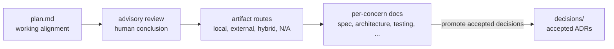

# Durable Context: The Model

The companion article,
[Durable Context: The Rationale](rationale.md), explains the painpoints:
reasoning lost to closed sessions, plans that cannot be shared, and context
that never survives a tool change. This article is the model that responds to
that problem.

Durable Context keeps planning context in the repository, structured enough
that humans and agents can find it, then distills the decisions that must
survive into an append-only decision log.

## The Two Roots

Durable Context installs two roots:

```text
context/     Disposable working bench for active planning and delivery context.
decisions/   Durable, append-only record of why the system is the way it is.
```

`context/` is allowed to drift. It is where teams work through ambiguity,
record tradeoffs, plan verification, name delivery risks, and leave notes for
future documentation. It is working-time scaffolding, not permanent history.

`decisions/` is the opposite. Accepted architectural and design decisions move
there so they remain findable after an initiative is archived.

Shipped-behavior documentation is a separate practice:
[Reference Docs](../reference-docs/model.md). Durable Context can leave
`release-doc-notes.md` for that later workflow, but it does not depend on it.

## The Working Bench

The working bench groups initiatives into generic cycles:

```text
context/
  project-profile.md
  cycles/
    default/initiatives/<slug>/
    <cycle-id>/initiatives/<slug>/
  _templates/initiative/
decisions/
  0001-some-decision.md
  0002-another-decision.md
```

Structure follows delivery concerns, not technologies. Name a file for the
knowledge it preserves, not the tool that produced it.

The `_templates/` folders live beside the documents they create on purpose.
Skills use them, but they are not private skill assets. Once installed, they
become part of the repository's operating model: a team can trim, rename,
expand, or specialize them to match how that repo plans, ships, documents, and
makes decisions.

`project-profile.md` holds stable repo-wide operating facts plus one marked
project-owned cycle section. That section records at most one current cycle and
local naming, retention, validation, and repository rules. Fresh installations
start with `default`; an initiative without an explicit cycle uses the current
cycle.

A cycle is only a namespace. The package does not decide whether it is a sprint,
release, milestone, quarter, or another cadence, and it does not create cycle
plans, capacity, schedules, goals, or project backlogs. Those belong in Jira,
GitHub, or the project's equivalent. Closed cycles are disposable working
memory and may eventually be deleted.

## Installed Invocation Skills

The installed skills are the operational interface to this model. They are
discoverable after install, but invocation-only: humans ask for them by name
when the work calls for that step.

- `durable-context` is the recommended front door. Given an explicit initiative
  name, it reads the recorded state and advances work to the next meaningful
  boundary. It never infers initiative identity from a branch name.
- `project-profile-baseline` establishes stable repo-wide operating facts in
  `context/project-profile.md`.
- `project-profile-refresh` updates those stable facts when repository behavior
  changes.
- `plan-with-context` creates or uses an initiative and drafts the durable plan
  in `plan.md`.
- `challenge` challenges a draft plan before it hardens.
- `dive-into-plan` interrogates gaps, distributes settled truth, and records or
  promotes ADRs.
- `backfill-with-context` reconstructs context when implementation grew beyond
  an ordinary plan before an initiative existed.
- `checkpoint-context` validates and records lifecycle state across sessions.

The specialist names are advanced direct entry points. Most users need to
remember only `durable-context`. For work that remains small, the front door
recommends normal agent planning rather than scaffolding an initiative.

## Initiative Lifecycle

Lifecycle-managed initiatives move through six phases:

```text
Planning -> Plan Review -> Detailed Design -> Implementation
         -> Verification -> PR Preparation
```

The accompanying condition is `Active`, `Paused`, `Blocked`, `Complete`, or
`Abandoned`. The README records the current state, next action, blockers, and a
compact checkpoint history. A checkpoint is written at meaningful decisions,
phase boundaries, pauses, review conclusions, implementation milestones, and
substantial session endings.

Plan Review is advisory. Skipping it is visible but does not require a waiver.
If review produces a material challenge, however, that challenge names the
later phases that depend on its conclusion. The challenge is not the authority: a
human resolves the challenge as Retain, Revise, Replace, or Accept Risk and
records rationale and trade-offs. Unrelated work can continue while review is
waiting.

Existing initiatives without lifecycle markers remain readable legacy context
and are not migrated automatically. Pre-cycle `context/initiatives/<slug>/`
folders are treated as implicit members of `default` without being moved.

## Initiatives

An initiative is one folder per meaningful piece of work:

```text
context/cycles/<cycle-id>/initiatives/<slug>/
  README.md   plan.md
  [applicable concern documents created on demand]
  [reviews/]  [decisions/]  [backfill.md]  [follow-up.md]
```

`plan.md` is the working alignment space. It can be messy with notes, options,
questions, and tradeoffs, with one rule:

> `plan.md` may be messy, but it must not be the only place settled truth
> lives.

New initiatives begin with only README and plan. During Detailed Design, first
agree where each concern belongs: Local, External, Hybrid, or Not applicable.
Record the reason, destination, evidence, and whether it blocks merge. Create a
local document only for Local and Hybrid routes. Once something stabilizes,
move it into the applicable file that owns that concern:

```text
spec.md              What the system should do.
interface.md         How clients, APIs, config, or tools interact with it.
architecture.md      Internal shape, boundaries, data flow, tradeoffs.
testing.md           Verification strategy, coverage, gates, known gaps.
delivery.md          CI/CD, build, deployment, promotion, release toggles.
infrastructure.md    Environments, IaC, networking, identity, storage, secrets.
operations.md        Runtime/support: observability, failure modes, rollback.
backlog.md           Bounded implementation state inside this initiative.
decisions/           Local ADR drafts; accepted ones promote to root decisions/.
release-doc-notes.md Optional notes for whoever maintains shipped-behavior docs.
```

Not every initiative needs every file. The templates are a library, not a
directory to copy wholesale. Empty stubs train everyone to skim past these
files; grow each initiative only when a concern earns a local home.

`backfill.md` is an evidence record for initiatives reconstructed after work
already exists. It separates observable facts, human-confirmed intent,
inferences, and unknowns, while `plan.md` holds the normalized direction.

`follow-up.md` records work that cannot or should not finish before merge. At
PR readiness each item is completed, transferred to a stable destination, or
explicitly transfer-waived by a human. The merged initiative is a final
disclosure, not a post-merge status tracker; the destination system owns work
after handover. Likewise, `backlog.md` preserves where implementation stands
inside this bounded initiative rather than replacing the project's backlog.

## Durable Decisions

Architecture and design choices need to outlive the initiative that produced
them. Proposed, recommended, planned, or in-progress ADRs stay local under the
initiative while the work is active. Accepted decisions promote to the root
decision log when they are implemented or explicitly ready for durable history.

Root decisions are self-contained: they must remain understandable after the
initiative or its whole cycle disappears and include stable PR, commit, or
release-tag provenance.
Initiative links are optional provenance. Full review and backfill records stay
on the disposable bench.

Root decisions are flat and numbered in order:

```text
decisions/
  0001-some-decision.md      Status: Accepted
  0002-another-decision.md   Status: Superseded by 0003
  0003-revised-decision.md   Status: Accepted
```

The log is append-only. When a decision changes, add a new entry and link both
directions with `Supersedes` and `Superseded by`. To see what is in force, read
entries marked `Accepted` and use the secondary indexes when the log grows.

The workflow is simple:


```mermaid
flowchart LR
  Plan["plan.md<br/>working alignment"]
  Review["advisory review<br/>human conclusion"]
  Route["artifact routes<br/>local, external, hybrid, N/A"]
  Distribute["per-concern docs<br/>spec, architecture, testing, ..."]
  Decisions["decisions/<br/>accepted ADRs"]

  Plan --> Review
  Review --> Route
  Route --> Distribute
  Distribute -->|"promote accepted decisions"| Decisions
```

## Use It Deliberately

Durable Context is for work where reasoning is expensive enough to keep:
large initiatives, cross-cutting changes, architectural tradeoffs, delivery
risks, or projects where future agents and humans need the same trail.

Small fixes still just ship. This model is useful because it gives durable
reasoning a home, not because every change deserves ceremony.

## Install

```bash
npx durable-context init --project-name "My App"
```

This adds `context/`, `decisions/`, and the invocation-only skills described
above.

After install, `npx durable-context@latest update` refreshes managed agent
skills and guidance without replacing `context/` or `decisions/`.

For where this model is not worth it, see
[Durable Context: Limitations](limitations.md). For what format the context
should live in, see
[Markdown For Work, HTML For People](../formats.md).
