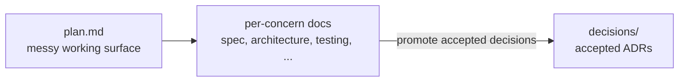

# Durable Context: The Structure

This is the companion to the
[reasoning article](why.md). It covers how the working
bench and decision log are laid out so both humans and agents can navigate them.

## Denormalize Navigation, Not Knowledge

Agents and IDEs do not always open from the repo root. They may start in
product code, CI/CD config, infrastructure code, generated artifacts, or a
nested app. If all guidance lives at the top, it gets missed. If each area
keeps its own plans, cross-project work fragments.

> Denormalize navigation, not knowledge.

Local `AGENTS.md` files point agents toward the right place. But plans, specs,
decisions, testing strategy, delivery notes, and infrastructure context live
centrally under `context/` and `decisions/`.

## The Layout

Durable Context installs two roots:

```text
context/     Disposable working bench; archive when done.
decisions/   Durable, append-only decision log.
```

The working bench is flat — no release folders, no programs:

```text
context/
  initiatives/<slug>/
  project-profile.md
  _templates/initiative/
decisions/
  0001-some-decision.md
  0002-another-decision.md
```

Structure follows delivery concerns, not technologies. Name a file for the
knowledge it preserves, not the tool that produced it.

## Initiatives

The main unit of active work is an initiative, one folder per piece of work in
progress:

```text
context/initiatives/<slug>/
  README.md   plan.md   spec.md   interface.md   architecture.md
  testing.md  delivery.md  infrastructure.md  operations.md
  backlog.md  decisions/  release-doc-notes.md
```

The most important file is `plan.md` — the working alignment space. It can be
messy with notes, options, and tradeoffs, with one rule:

> `plan.md` may be messy, but it must not be the only place settled truth lives.

Once something stabilizes, it moves to a durable file:

```text
spec.md              What the system should do.
interface.md         How clients, APIs, config, or tools interact with it.
architecture.md      Internal shape, boundaries, data flow, tradeoffs.
testing.md           Verification strategy, coverage, gates, known gaps.
delivery.md          CI/CD, build, deployment, promotion, release toggles.
infrastructure.md    Environments, IaC, networking, identity, storage, secrets.
operations.md        Runtime/support: observability, failure modes, rollback.
backlog.md           Trackable work items and progress.
decisions/           Local ADR drafts; accepted ones promote to ../../decisions/.
release-doc-notes.md Optional notes for whoever maintains shipped-behavior docs.
```

Not every initiative needs every file. The point is to give stable knowledge a
place to land — testing, delivery, and infrastructure are first-class context,
not afterthoughts buried in pipeline files or PRs.

Treat the template as a starting point to tune, not a checklist to satisfy.
Start with the files the work actually needs — often just `README.md`,
`plan.md`, and a `spec.md` — and add the rest only when there is real knowledge
to put in them. Empty stubs train everyone to skim past these files; trim the
template down to your project and grow it deliberately.

## Durable Decisions

`context/` is a disposable bench — it drifts by design and is archived once the
work it described has shipped. That makes it the wrong home for the decisions
you want to keep. Architecture and design choices need to outlive the
initiative that produced them.

So accepted decisions are promoted out of an initiative's local `decisions/`
into the top-level log:

```text
decisions/
  0001-some-decision.md      Status: Accepted
  0002-another-decision.md   Status: Superseded by 0003
  0003-revised-decision.md   Status: Accepted
```

The log is append-only and numbered in order. You do not rewrite history: when
a decision changes, you add a new entry and mark the old one `Superseded`. Each
entry records its status (`Accepted`, `Superseded`, `Deprecated`), the context,
the decision, its consequences, and a backlink to where it was made. To see
what is in force right now, you read the entries marked `Accepted` — no digging
through months of folders required.

The planning workflow is what distills the bench into these durable artifacts:



## Install

```bash
npx durable-context init --project-name "My App"
```

This adds `context/`, `decisions/`, and skills
(`plan-with-context`, `dive-into-plan`).

For release-anchored documentation, see
[Reference Docs](../reference-docs/why.md).

For what format the context should live in, see the shared companion
[Markdown For Work, HTML For People](../formats.md).
