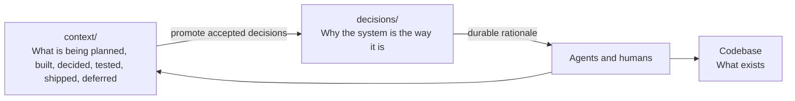

# Durable Context: Why

The companion article,
[Durable Context: The Rationale](rationale.md), laid
out the painpoints — reasoning lost to closed sessions, plans that cannot be
shared, context that never survives a tool change. This article is the
principle that resolves them.

Coding agents are good at reading repositories, editing files, and following
instructions. But in large codebases, code is not the whole story.

The hard part is not whether an agent can change a file. It is whether it
understands the intent behind the change, the decisions already made, the work
deliberately deferred, how the change should be verified, how it ships, and what
infrastructure or operational risks surround it.

That context usually exists — in chats, tickets, pull request comments,
planning notes, and people's heads — but agents need it in a structured,
discoverable form.

## Two Kinds Of Truth On This Side

**Durable Context** owns the working bench and the decision log — two kinds of
truth with different lifetimes:

```text
context/     What we are planning, building, deciding, testing,
             shipping, hosting, deferring, and learning right now.
             Disposable working bench; archive when done.
decisions/   Why the system is the way it is — durable, append-only.
```

Working context is allowed to evolve — it is where humans and agents work
through ambiguity. The decision log is not disposable: it is the durable record
of *why* the choices were made.

Be aware that this means `context/` *drifts by design*. It is working-time
scaffolding, not the source of truth. So the durable conclusions are extracted
before the bench is archived: accepted decisions are promoted into `decisions/`,
and any future product-doc impact can be noted in `release-doc-notes.md` for
whoever maintains shipped-behavior docs later. The bench is then free to move on.

Shipped-behavior documentation is a separate practice —
[Reference Docs](../reference-docs/why.md) — with its own lifetime and
workflow. Durable Context does not depend on it.

## The Principle

I think of this as **Durable Context**. Not a methodology — a rule of thumb:

> Keep planning context in the repository, structured enough that both humans
> and agents can find it — and distill what must survive into a durable decision
> log before the working bench is archived.

It is opinionated on purpose: prefer repository-local context, explicit
lifetimes, and navigable structure over scattered notes that only make sense
to the people who were in the room. Repository-local context scales beyond one
person. What you plan durably becomes the agent's working context when
implementation starts.

## Who This Is For

This assumes a harness-engineering model: an engineer working *through* an
agent and staying accountable for the result, not a fully autonomous agent
documenting itself unsupervised. The structure pays off because a human plans,
reviews, and implements deliberately — often across separate sessions — rather
than asking one session to do everything at once.

That separation also dissolves the obvious objection that all this context will
crowd the agent's context window. It only competes if you do everything in one
go. When planning happens in one session, review in another, and implementation
in a third that refers back to the settled plan, each session carries only what
it needs. For the cases where this model is the wrong fit, see the companion
article,
[Durable Context: Limitations](limitations.md).

## Where It Shines

The value compounds with how code-first your repository already is. The more of
your system that lives as code and CLI-driven tooling — infrastructure as code,
CI/CD as code, end-to-end suites like Playwright, integration and unit tests,
deployment and operational scripts — the more an agent can take in at once.

That breadth is what changes the agent's behavior. When the surrounding system
is visible as code, the agent is forced to look at the big picture: it can judge
whether a change is trivial or massive, reason about the overall impact across
boundaries it would otherwise never see, and propose alternatives instead of
just executing the first path that works. Context is the difference between an
agent that edits a file and one that understands the blast radius of the edit.

This is why the approach spans the whole arc — from planning to observability
and everything in between. Each code-first surface you add is one more place the
agent inherits context for free, and one less place where it has to guess.

## Why It Travels

When context is materialized in the repository, it stops being tied to one
chat transcript, IDE, agent, or session. A team can switch tools without
losing the trail of why the system is shaped the way it is. The next human or
agent opens the repo and continues from the same accumulated understanding
instead of reconstructing it from memory.



## A Deliberate Composition

None of the individual pieces here are novel, and that is intentional.
Architecture decision records, monorepo context conventions, and spec-driven
development each already solve part of the problem. Durable Context does not
try to replace them — it composes them around one organizing idea: a disposable
working bench and a durable decision log, made navigable for both humans and
agents.

The contribution is the lifetimes, not a new primitive. If you already practice
ADRs, you are most of the way here; this gives those habits a shared home and
an explicit path from messy planning to settled truth.

The practice ships as `durable-context` — invocation-only skills
(`plan-with-context`, `dive-into-plan`) plus the `context/` and
`decisions/` scaffold. It has no hard dependency on
[Reference Docs](../reference-docs/why.md).

## Why It Matters

Durable Context is context continuity. It helps agents and humans answer:

- What is active now, and what belongs to a future phase?
- What was cut from scope, and why was a decision made?
- How should this be tested, and what gates must pass before release?
- How will it ship, and what infrastructure does it depend on?
- What reasoning needs to survive a change of IDE, agent, or session?

Code tells an agent *what exists*. Working context tells it *why* it
exists, where it is going, what has been decided, and what was left for later.

For the concrete folder layout, see the companion article,
[Durable Context: The Structure](structure.md).
